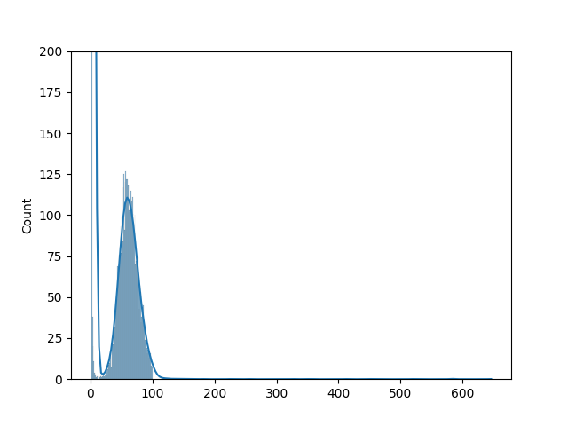

# sourmash_plugin_abundhist

## Installation

```
pip install sourmash_plugin_abundhist
```

## Usage

### Example


#### Basic command-line usage:
```
% sourmash scripts abundhist examples/SRR606249-abund-100k.sig.zip

== This is sourmash version 4.8.3.dev0. ==
== Please cite Brown and Irber (2016), doi:10.21105/joss.00027. ==

loaded 1 total that matched ksize & molecule type

36   [3487]  ****************************************
72   [ 485]  ******
107  [ 171]  **
143  [  38]  *
178  [   5]
214  [   3]
249  [   7]  *
285  [   0]
320  [   2]
356  [   2]
```

#### Create a nice histogram figure for an isolate reads data set

```
sourmash scripts abundhist --max 100 --min 1 --bins 100 examples/reads.sig.gz --figure examples/ecoli-reads.png --ymax=200
```

will create:



#### Create a nice histogram figure for a metagenome:

```
% sourmash scripts abundhist examples/SRR606249-abund-100k.sig.zip --figure hist.png
```
will create this figure:


## Support

We suggest filing issues in [the main sourmash issue tracker](https://github.com/dib-lab/sourmash/issues) as that receives more attention!

## Dev docs

`abundhist` is developed at https://github.com/ctb/sourmash_plugin_abundhist.

### Testing

Run:
```
pytest tests
```

### Generating a release

Bump version number in `pyproject.toml` and push.

Make a new release on github.

Then pull, and:

```
python -m build
```

followed by `twine upload dist/...`.
